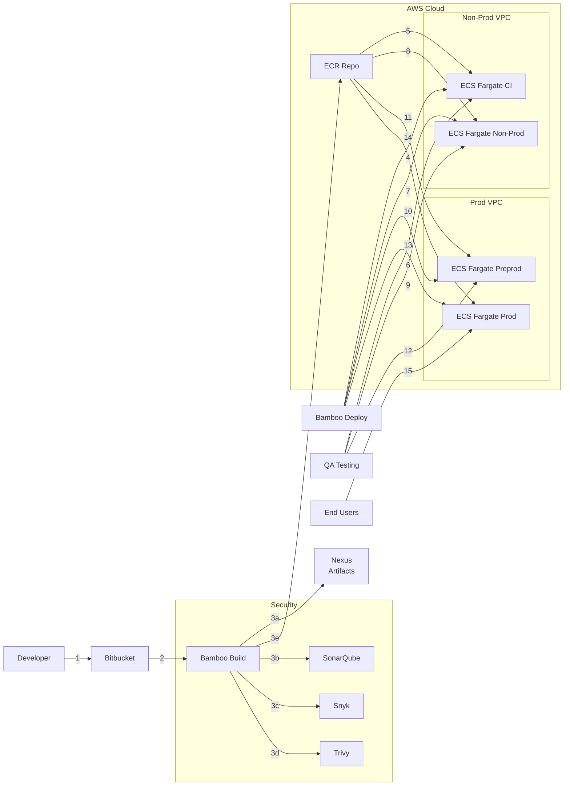

# DevSecOps Assessment: Build and Deployment Automation Design

**Prepared for Zurich Interview Session**  
**Date:** February 21, 2025  
**Author:** Heidi Ni

---

## Table of Contents
1. [Introduction](#introduction)
2. [Technology Stack](#technology-stack)
3. [Design Overview](#design-overview)
4. [Application CI/CD Template](#application-cicd-template)
5. [Infrastructure CI/CD Template](#infrastructure-cicd-template)
6. [Environment Segregation](#environment-segregation)
7. [Container Management](#container-management)
8. [Secrets Management](#secrets-management)
9. [Security Measures](#security-measures)
10. [Branching Strategy](#branching-strategy)
11. [Architecture Diagram](#architecture-diagram)
12. [Conclusion](#conclusion)

---

## Introduction

This document outlines a DevSecOps solution for an Insurer in the APAC region, delivering reusable CI/CD templates for infrastructure and multi-language applications (Python, Java, NodeJS) to support digitization efforts in the APAC region. The design automates build and deployment to AWS ECS Fargate across CI, Non-Prod, Preprod, and Prod environments.

---

## Technology Stack

- **Application:** Python (extensible to Java/NodeJS)
- **Version Control:** Bitbucket
- **CI/CD:** Bamboo
- **Infra Provisioning:** Terraform
- **Container Registry:** AWS ECR (non-prod and prod accounts)
- **Runtime:** AWS ECS with Fargate (4 services, ci,non-prod, preprod, prod)
- **Artifact Management:** Nexus (Jars, Wheels)
- **Code Quality:** SonarQube
- **Security:** AWS Secrets Manager, GuardDuty, Trivy, Snyk

---

## Design Overview

The solution provides reusable CI/CD pipeline templates for application builds and infrastructure provisioning, supporting multi-language applications (Python, Java, NodeJS). It deploys four AWS ECS Fargate services across multiple Availability Zones (AZs) within two Virtual Private Clouds (VPCs), split between two AWS accounts for enhanced isolation:

- **Non-Prod VPC** (non-prod account): Hosts CI and Non-Prod ECS Fargate services.
- **Prod VPC** (prod account): Hosts Preprod and Prod ECS Fargate services.

This structure ensures high availability, scalability, and security across development, testing, and production environments.

### Key Features
- **Parameterized Bamboo Pipelines**: Leverage variables (`PROJECT_KEY`, `APP_NAME`, `LANGUAGE`, `ENV`) to enable a single template to support multiple applications, teams, and environments, reducing duplication.
- **Terraform-Managed Infrastructure with Validation**: Uses Terraform with `terraform validate` to provision ECS clusters and VPCs, ensuring configuration integrity.
- **Secure, Account-Isolated Workflow**: Enforces separation with distinct ECR repositories (non-prod for CI/Non-Prod, prod for Preprod/Prod) and VPC-level isolation.

---

## Application CI/CD Template

**Purpose:** Build, test, containerize, and deploy applications across environments, supporting multiple languages (Python, Java, NodeJS).

In order to support multiple programming language, we will use Makefile for each application to provide a standard way to define build, test, and deployment steps while keeping the bamboo pipeliners simple and flexible across different programming languages

### Example Makefile
#### Python project:

```makefile
# Makefile (Python)
.PHONY: build test lint sonar security docker

build: lint test sonar security
	pip install -r requirements.txt
	python -m py_compile src/*.py

test:
	pytest

lint:
	pylint src/*.py

sonar:
	sonar-scanner \
		-Dsonar.projectKey=${APP_NAME} \
		-Dsonar.sources=src \
		-Dsonar.host.url=${SONAR_HOST_URL} \
		-Dsonar.login=${SONAR_TOKEN}

security:
	snyk test --severity-threshold=high

publish:
	twine upload --repository-url ${NEXUS_URL}/repository/pypi-hosted/ dist/*.tar.gz dist/*.whl --username ${NEXUS_USERNAME} --password ${NEXUS_PASSWORD}

docker:
	docker build -t ${APP_NAME}:${BUILD_NUMBER:-local} .
	trivy image --scanners vuln,secret --exit-code 1 --severity CRITICAL,HIGH ${APP_NAME}:${BUILD_NUMBER:-local}

```
---
#### Java App

```makefile
# Makefile (Java)
.PHONY: build test sonar security docker

build: lint test sonar security
	mvn clean package

test:
	mvn test

lint:
	mvn checkstyle:check   

sonar:
	mvn sonar:sonar \
		-Dsonar.projectKey=${APP_NAME} \
		-Dsonar.host.url=${SONAR_HOST_URL} \
		-Dsonar.login=${SONAR_TOKEN}

security:
	snyk test --severity-threshold=high

publish:
	mvn deploy -DaltDeploymentRepository=nexus::default::${NEXUS_URL}/repository/maven-releases/ -Dusername=${NEXUS_USERNAME} -Dpassword=${NEXUS_PASSWORD}

docker:
	docker build -t ${APP_NAME}:${BUILD_NUMBER:-local} .
	trivy image --scanners vuln,secret --exit-code 1 --severity CRITICAL,HIGH ${APP_NAME}:${BUILD_NUMBER:-local}

```

#### NodeJS
```makefile
# Makefile (NodeJS)
.PHONY: build test sonar security docker

build: test sonar security
	npm install
	npm run build

test:
	npm test

sonar:
	sonar-scanner \
		-Dsonar.projectKey=${APP_NAME} \
		-Dsonar.sources=. \
		-Dsonar.host.url=${SONAR_HOST_URL} \
		-Dsonar.login=${SONAR_TOKEN}

security:
	snyk test --severity-threshold=high

publish:
	npm publish --registry ${NEXUS_URL}/repository/npm-hosted/ --//${NEXUS_URL}/repository/npm-hosted/:_authToken=${NEXUS_AUTH_TOKEN}

docker:
	docker build -t ${APP_NAME}:${BUILD_NUMBER:-local} .
	trivy image --scanners vuln,secret --exit-code 1 --severity CRITICAL,HIGH ${APP_NAME}:${BUILD_NUMBER:-local}

```
---
## Application Build Pipeline

**Purpose:** Build, test, and containerize applications in the CI environment, publishing artifacts to Nexus and images to ECR.

```yaml
# bamboo-specs/app-build-pipeline.yml
---
version: 2
plan:
  project-key: ${bamboo.PROJECT_KEY}
  key: ${bamboo.APP_NAME}-BUILD
  name: ${bamboo.APP_NAME} Build

variables:
  PROJECT_KEY: ${bamboo.PROJECT_KEY}
  REPO_URL: ${bamboo.REPO_URL}
  APP_NAME: ${bamboo.APP_NAME}
  ENV: "ci"  # Fixed to CI environment
  AWS_ACCOUNT: ${bamboo.AWS_ACCOUNT}
  AWS_REGION: ${bamboo.AWS_REGION}
  ECR_URL: "${bamboo.AWS_ACCOUNT}.dkr.ecr.${bamboo.AWS_REGION}.amazonaws.com"
  SONAR_HOST_URL: ${bamboo.SONAR_HOST_URL}
  SONAR_TOKEN: ${bamboo.SONAR_TOKEN}
  SNYK_TOKEN: ${bamboo.SNYK_TOKEN}
  BUILD_NUMBER: ${bamboo.buildNumber}
  NEXUS_URL: ${bamboo.NEXUS_URL}
  NEXUS_USERNAME: ${bamboo.NEXUS_USERNAME}
  NEXUS_PASSWORD: ${bamboo.NEXUS_PASSWORD}
  NEXUS_AUTH_TOKEN: ${bamboo.NEXUS_AUTH_TOKEN}

stages:
  - Build Stage:
      jobs:
        - Build
  - SonarQube Analysis Stage:
      jobs:
        - SonarQube Analysis
  - Dockerize Stage:
      jobs:
        - Dockerize

Build:
  tasks:
    - checkout:
        repository: ${bamboo.REPO_URL}
    - script:
        - pip install twine  # For Python; adjust per language if needed
        - make build
        - make publish  # Publishes artifacts to Nexus

SonarQube Analysis:
  tasks:
    - script:
        - make sonar

Dockerize:
  tasks:
    - script:
        - make docker  # Builds and scans image with Trivy
        - aws ecr get-login-password --region ${AWS_REGION} --profile ${AWS_ACCOUNT} | docker login --username AWS --password-stdin ${ECR_URL}
        - docker tag ${APP_NAME}:${bamboo.buildNumber} ${ECR_URL}/${APP_NAME}:${bamboo.buildNumber}
        - docker push ${ECR_URL}/${APP_NAME}:${bamboo.buildNumber}
        - aws ecr batch-get-image --region ${AWS_REGION} --profile ${AWS_ACCOUNT} --repository-name ${APP_NAME} --image-ids imageTag=${bamboo.buildNumber} --output json | jq -r '.images[0].imageManifest' > manifest.json
        - aws ecr put-image --region ${AWS_REGION} --profile ${AWS_ACCOUNT} --repository-name ${APP_NAME} --image-tag ${ENV}-latest --image-manifest file://manifest.json
        - echo "IMAGE_TAG=${bamboo.buildNumber}" > image-tag.properties  # Stores the Docker image tag
  artifacts:
    - name: image-tag
      pattern: "image-tag.properties
```
---
## Application Deploy Pipeline

**Purpose:** Deploy pre-built container images to ECS clusters across all environments, with manual approval for `preprod` and `prod`.

```yaml
# bamboo-specs/app-deploy-pipeline.yml
---
version: 2
plan:
  project-key: ${bamboo.PROJECT_KEY}
  key: ${bamboo.APP_NAME}-DEPLOY
  name: ${bamboo.APP_NAME} Deploy

variables:
  PROJECT_KEY: ${bamboo.PROJECT_KEY}
  APP_NAME: ${bamboo.APP_NAME}
  ENV: ${bamboo.ENV}  # ci, nonprod, preprod, prod
  AWS_ACCOUNT: ${bamboo.AWS_ACCOUNT}
  AWS_REGION: ${bamboo.AWS_REGION}
  ECR_URL: "${bamboo.AWS_ACCOUNT}.dkr.ecr.${bamboo.AWS_REGION}.amazonaws.com"
  BUILD_NUMBER: ${bamboo.BUILD_NUMBER}  # Passed from build pipeline
  MANUAL_APPROVAL: "false"  # Default: no manual approval

stages:
  - Approval Stage:
      manual: ${bamboo.MANUAL_APPROVAL}  # True for preprod/prod, false for ci/nonprod
      jobs:
        - Approval
  - Deploy Stage:
      jobs:
        - Deploy

Approval:
  tasks:
    - script:
        - echo "Approval stage for ${ENV} - manual: ${bamboo.MANUAL_APPROVAL}"

Deploy:
  tasks:
    - script:
        - aws ecs update-service --region ${AWS_REGION} --profile ${AWS_ACCOUNT} --cluster ${PROJECT_KEY}-ecs-${ENV} --service ${PROJECT_KEY}-${APP_NAME}-${ENV} --force-new-deployment
```                
---
## Application Deploy Pipeline

**Purpose:** Deploy pre-built container images to ECS clusters across all environments, with manual approval dynamically set for `preprod` and `prod`.

```yaml
# bamboo-specs/app-deploy-pipeline.yml
---
version: 2
plan:
  project-key: ${bamboo.PROJECT_KEY}
  key: ${bamboo.APP_NAME}-DEPLOY
  name: ${bamboo.APP_NAME} Deploy

variables:
  PROJECT_KEY: ${bamboo.PROJECT_KEY}
  APP_NAME: ${bamboo.APP_NAME}
  ENV: ${bamboo.ENV}  # ci, nonprod, preprod, prod
  AWS_ACCOUNT: ${bamboo.AWS_ACCOUNT}
  AWS_REGION: ${bamboo.AWS_REGION}
  ECR_URL: "${bamboo.AWS_ACCOUNT}.dkr.ecr.${bamboo.AWS_REGION}.amazonaws.com"
  BUILD_NUMBER: ${bamboo.BUILD_NUMBER}

stages:
  - Configure Stage:
      jobs:
        - Configure
  - Approval Stage:
      manual: ${bamboo.MANUAL_APPROVAL}
      jobs:
        - Approval
  - Deploy Stage:
      jobs:
        - Deploy

Configure:
  tasks:
    - script:
        - |
          if [ "$ENV" = "preprod" ] || [ "$ENV" = "prod" ]; then
            echo "Setting MANUAL_APPROVAL=true for ${ENV}"
            echo "bamboo.MANUAL_APPROVAL=true" >> $bamboo_plan_variables_file
          else
            echo "Setting MANUAL_APPROVAL=false for ${ENV}"
            echo "bamboo.MANUAL_APPROVAL=false" >> $bamboo_plan_variables_file
          fi

Approval:
  tasks:
    - script:
        - echo "Approval stage for ${ENV} - manual: ${bamboo.MANUAL_APPROVAL}"

Deploy:
  tasks:
    - artifact-download:
        source-plan: ${bamboo.PROJECT_KEY}-${bamboo.APP_NAME}-BUILD
        artifact: image-tag
    - script:
        - IMAGE_TAG=$(cat image-tag.properties | grep IMAGE_TAG | cut -d'=' -f2)
        - aws ecs update-service --region ${AWS_REGION} --profile ${AWS_ACCOUNT} --cluster ${PROJECT_KEY}-ecs-${ENV} --service ${PROJECT_KEY}-${APP_NAME}-${ENV} --force-new-deployment

```        
## Infrastructure CI/CD Template

**Purpose:** Provision infrastructure with Terraform across all environments (CI, Non-Prod, Preprod, Prod), with manual approval dynamically set for `preprod` and `prod` environments to ensure controlled deployment to production-like systems.

```yaml
# bamboo-specs/infra-pipeline.yml
---
version: 2
plan:
  project-key: ${bamboo.PROJECT_KEY}
  key: INFRA
  name: ${bamboo.PROJECT_KEY} Infrastructure Provisioning

variables:
  PROJECT_KEY: ${bamboo.PROJECT_KEY}
  INFRA_REPO_URL: ${bamboo.INFRA_REPO_URL}
  ENV: ${bamboo.ENV}  # ci, nonprod, preprod, prod
  AWS_ACCOUNT: ${bamboo.AWS_ACCOUNT}  # nonprod or prod
  AWS_REGION: ${bamboo.AWS_REGION}

stages:
  - Configure Stage:
      jobs:
        - Configure
  - Validate Stage:
      jobs:
        - Validate
  - Plan Stage:
      jobs:
        - Plan
  - Approval Stage:
      manual: ${bamboo.MANUAL_APPROVAL}  # Set dynamically: false for ci/nonprod, true for preprod/prod
      jobs:
        - Approval
  - Apply Stage:
      jobs:
        - Apply

Configure:
  tasks:
    - script:
        - |
          if [ "$ENV" = "preprod" ] || [ "$ENV" = "prod" ]; then
            echo "Setting MANUAL_APPROVAL=true for ${ENV}"
            echo "bamboo.MANUAL_APPROVAL=true" >> $bamboo_plan_variables_file
          else
            echo "Setting MANUAL_APPROVAL=false for ${ENV}"
            echo "bamboo.MANUAL_APPROVAL=false" >> $bamboo_plan_variables_file
          fi

Validate:
  tasks:
    - checkout:
        repository: ${bamboo.INFRA_REPO_URL}
    - script:
        - terraform init
        - terraform validate

Plan:
  tasks:
    - checkout:
        repository: ${bamboo.INFRA_REPO_URL}
    - script:
        - terraform init
        - terraform plan -var-file=${ENV}.tfvars

Approval:
  tasks:
    - script:
        - echo "Approval stage for ${ENV} - manual: ${bamboo.MANUAL_APPROVAL}"

Apply:
  tasks:
    - script:
        - terraform init
        - terraform apply -var-file=${ENV}.tfvars -auto-approve
```        
---
### Terraform Configuration

**Purpose:** Defines Terraform infrastructure for ECS Fargate services across CI, Non-Prod, Preprod, and Prod environments, integrated with the Bamboo CI/CD pipeline.

```hcl
# main.tf
provider "aws" {
  region  = var.region
  profile = var.aws_account  # Assumes AWS CLI profiles 'nonprod' and 'prod'
}

# Non-Prod VPC (CI and Non-Prod)
module "nonprod_vpc" {
  count  = var.env == "ci" || var.env == "nonprod" ? 1 : 0
  source = "terraform-aws-modules/vpc/aws"
  name   = "${var.project_key}-nonprod-vpc"
  cidr   = "10.1.0.0/16"
  azs    = ["${var.region}a", "${var.region}b"]
  private_subnets = ["10.1.1.0/24", "10.1.2.0/24"]
  public_subnets  = ["10.1.101.0/24", "10.1.102.0/24"]
  enable_nat_gateway = true
}

# Prod VPC (Preprod and Prod)
module "prod_vpc" {
  count  = var.env == "preprod" || var.env == "prod" ? 1 : 0
  source = "terraform-aws-modules/vpc/aws"
  name   = "${var.project_key}-prod-vpc"
  cidr   = "10.2.0.0/16"
  azs    = ["${var.region}a", "${var.region}b"]
  private_subnets = ["10.2.1.0/24", "10.2.2.0/24"]
  public_subnets  = ["10.2.101.0/24", "10.2.102.0/24"]
  enable_nat_gateway = true
}

# ECS Cluster
resource "aws_ecs_cluster" "ecs" {
  name = "${var.project_key}-ecs-${var.env}"
}

# ECS Services (One per environment)
resource "aws_ecs_service" "service" {
  for_each = toset(["ci", "nonprod", "preprod", "prod"])
  name            = "${var.project_key}-${var.app_name}-${each.key}"
  cluster         = aws_ecs_cluster.ecs.id
  task_definition = aws_ecs_task_definition.task[each.key].arn
  launch_type     = "FARGATE"
  desired_count   = 1
  network_configuration {
    subnets         = each.key == "ci" || each.key == "nonprod" ? module.nonprod_vpc[0].private_subnets : module.prod_vpc[0].private_subnets
    security_groups = [aws_security_group.ecs[each.key].id]
    assign_public_ip = "DISABLED"
  }
  depends_on = [module.nonprod_vpc, module.prod_vpc]
}

# Task Definitions (One per environment)
resource "aws_ecs_task_definition" "task" {
  for_each = toset(["ci", "nonprod", "preprod", "prod"])
  family                   = "${var.project_key}-${var.app_name}-${each.key}"
  network_mode             = "awsvpc"
  requires_compatibilities = ["FARGATE"]
  cpu                      = "256"
  memory                   = "512"
  container_definitions    = jsonencode([{
    name  = "${var.app_name}"
    image = "${var.ecr_url}/${var.app_name}:${each.key}-latest"
    essential = true
    portMappings = [{ containerPort = 80 }]
  }])
}

# Security Groups (One per environment)
resource "aws_security_group" "ecs" {
  for_each = toset(["ci", "nonprod", "preprod", "prod"])
  vpc_id = each.key == "ci" || each.key == "nonprod" ? module.nonprod_vpc[0].vpc_id : module.prod_vpc[0].vpc_id
  ingress {
    from_port   = 80
    to_port     = 80
    protocol    = "tcp"
    cidr_blocks = ["0.0.0.0/0"]  # Adjust as needed
  }
  egress {
    from_port   = 0
    to_port     = 0
    protocol    = "-1"
    cidr_blocks = ["0.0.0.0/0"]
  }
  depends_on = [module.nonprod_vpc, module.prod_vpc]
}

# variables.tf (Required variables, assumed elsewhere)
variable "region" {}
variable "aws_account" {}
variable "env" {}
variable "project_key" {}
variable "app_name" {}
variable "ecr_url" {}

```

## Environment Segregation

**Design:** Infrastructure and application deployments are segregated into four environments, each with distinct roles and isolation levels, managed across two AWS accounts:

- **CI (`ENV=ci`)**: Continuous Integration environment in the non-prod AWS account and Non-Prod VPC, used for rapid feedback on builds and initial deployments.
- **Non-Prod (`ENV=nonprod`)**: Testing environment in the non-prod AWS account and Non-Prod VPC, for system and regression testing.
- **Preprod (`ENV=preprod`)**: Pre-production environment in the prod AWS account and Prod VPC, mirroring production for final validation.
- **Prod (`ENV=prod`)**: Production environment in the prod AWS account and Prod VPC, serving live traffic.

**Implementation:**
- **AWS Accounts**: Non-prod account for CI and Non-Prod; prod account for Preprod and Prod.
- **VPCs**: Non-Prod VPC (`10.1.0.0/16`) for CI and Non-Prod; Prod VPC (`10.2.0.0/16`) for Preprod and Prod, provisioned by Terraform.
- **ECS Clusters**: One per environment (e.g., `${PROJECT_KEY}-ecs-ci`), isolated within their respective VPCs.
- **Deployment Control**: CI and Non-Prod deploy automatically; Preprod and Prod require manual approval via `MANUAL_APPROVAL` set dynamically based on `ENV`.

## Container Management

**Deisgn:** Container images are built once in the CI environment and stored in a single ECR repository, reused across all environments (CI, Non-Prod, Preprod, Prod) with appropriate access controls.

- **Image Creation**: Built in the Application Build Pipeline (`ENV=ci`) using `make docker`, tagged with `${APP_NAME}:${bamboo.buildNumber}` (e.g., `myapp:123`).
- **Storage**: Pushed to a single ECR repository in the non-prod AWS account (`${AWS_ACCOUNT_NONPROD}.dkr.ecr.${AWS_REGION}.amazonaws.com/${APP_NAME}`), accessible to all environments:
  - CI and Non-Prod deploy directly from this ECR.
  - Preprod and Prod pull from the same ECR, with IAM policies granting cross-account access from the prod account.
- **Tagging**:
  - Build-specific tag: `${bamboo.buildNumber}` (e.g., `myapp:123`).
  - Environment-specific latest tag: `${ENV}-latest` (e.g., `ci-latest`, `prod-latest`), updated via ECR `put-image` in the Build Pipeline for CI, and optionally in the Deploy Pipeline for other environments.
- **Version Tracking**: Stored in `image-tag.properties` (e.g., `IMAGE_TAG=123`) as a Bamboo artifact, passed to the Deploy Pipeline.
- **Access Control**:
- Non-prod account IAM policy allows push/pull for CI/Non-Prod.
- Prod account IAM role allows pull-only access for Preprod/Prod:

 ```json
    {
      "Effect": "Allow",
      "Action": [
        "ecr:BatchGetImage",
        "ecr:GetDownloadUrlForLayer"
      ],
      "Resource": "arn:aws:ecr:${AWS_REGION}:${AWS_ACCOUNT_NONPROD}:repository/${APP_NAME}"
    }
```
## Secrets Management

**Approach:** Sensitive data (e.g., passwords, API keys) is securely managed using AWS Secrets Manager, ensuring no hardcoded secrets in code or images.

- **Storage**: Secrets are stored in AWS Secrets Manager with ARNs like `arn:aws:secretsmanager:${AWS_REGION}:${AWS_ACCOUNT}:secret:${PROJECT_KEY}-${APP_NAME}-${ENV}-key`.
- **Access**: ECS tasks retrieve secrets via IAM roles with permissions to access Secrets Manager, configured in task definitions:
  ```json
  "secrets": [
    {
      "name": "DB_PASSWORD",
      "valueFrom": "arn:aws:secretsmanager:${AWS_REGION}:${AWS_ACCOUNT}:secret:${PROJECT_KEY}-${APP_NAME}-${ENV}-db-pass"
    }
  ]
  ```
- **Pipeline Security:** Bamboo uses encrypted variables (e.g., SONAR_TOKEN, SNYK_TOKEN, NEXUS_PASSWORD) for pipeline credentials, avoiding exposure in YAML.  

## Security Measures

**Objective:** Ensure security across code, dependencies, containers, and runtime, preventing vulnerabilities and sensitive data leaks.

**Proposed Tools:**
- **SonarQube**: Static code analysis within `make sonar` in the Build Pipeline.

```makefile
sonar:
    sonar-scanner -Dsonar.projectKey=${APP_NAME} -Dsonar.host.url=${SONAR_HOST_URL} -Dsonar.login=${SONAR_TOKEN}
```
- **Snyk**: Dependency scanning within make security    
```makefile
security:
    snyk test --severity-threshold=high
``` 
- **Trivy:** Container vulnerability and secret scanning within make docker     
```makefile
docker:
    docker build -t ${APP_NAME}:${BUILD_NUMBER} .
    trivy image --scanners vuln,secret --exit-code 1 --severity CRITICAL,HIGH ${APP_NAME}:${BUILD_NUMBER}
```  
- **AWS Inspector:** Continuous ECR image scanning post-push, enabled via: 
```hcl
resource "aws_ecr_repository" "app" {
  image_scanning_configuration {
    scan_on_push = true
  }
}
```   
- **AWS GuardDuty:** Runtime threat detection across AWS accounts.
```hcl
resource "aws_guardduty_detector" "detector" {
  enable = true
}
```
- **AWS Mercie:** Sensitive data discovery and protection, configured to identify and secure PII or sensitive data in S3 buckets used by the application.
```hcl
resource "aws_macie2_account" "macie" {
  finding_publishing_frequency = "FIFTEEN_MINUTES"
  status                       = "ENABLED"
}
```
---
## Branching Strategy
**Objective:**  Ensures controlled progression from development to production, with automated testing in CI/Non-Prod and manual gates for Preprod/Prod.

**Flow:** Git branching strategy supports the CI/CD workflow:
- **`feature/*`**: Feature development branches, merged into `develop` for CI testing.
- **`develop`**: Integration branch for CI (`ENV=ci`), triggers Build Pipeline on commits.
- **`nonprod`**: Testing branch for Non-Prod (`ENV=nonprod`), triggers Deploy Pipeline after PR from `develop`.
- **`release/*`**: Pre-production staging branches for Preprod (`ENV=preprod`), triggers Deploy Pipeline with manual approval.
- **`main`**: Production branch for Prod (`ENV=prod`), triggers Deploy Pipeline with manual approval after PR from `release/*`.

---


## Architecture Diagram
 


The diagram shows the following workflow:

### Build 
1. **Code Commit**: An application developer commits code to a Bitbucket repository.
2. **Bambpp Build**: A Build Pipeline is initiated
3. **Bamboo Build**: The pipeline builds, tests, publish artifacts and pushes a Docker image (e.g., `${APP_NAME}:${bamboo.buildNumber}`) to a single Amazon ECR repository in the non-prod AWS account, storing the image tag in `image-tag.properties`.
### CI Deployment
4. **CI Deployment**: The Bamboo Deploy Pipeline for CI (`ENV=ci`) is automatically initiated post-build, deploying the new image to an existing Fargate service in the CI Amazon ECS cluster.
5. **CI Image Pull**: Amazon ECS pulls the image from the ECR repository into the CI Fargate service.
6. **CI Testing**: Automated testing and manual testing is performed using a CI-specific URL (e.g., `ci-app.example.com`).
###NonProd Deployment
7. **NonProd Deployment**: A PR merged into the `nonprod` branch triggers the Bamboo Deploy Pipeline for Non-Prod (`ENV=nonprod`), automatically deploying the image to an existing Fargate service in the Non-Prod Amazon ECS cluster.
8. **NonProd Image Pull**: Amazon ECS pulls the image from the ECR repository into the Non-Prod Fargate service.
9. **NonProd Testing**: System and regression testing are conducted using a Non-Prod URL (e.g., `nonprod-app.example.com`).
### PreProd Deployment
10. **Preprod Deployment**: A PR merged into a `release/*` branch triggers the Bamboo Deploy Pipeline for Preprod (`ENV=preprod`), which pauses for manual approval before deploying the image to an existing Fargate service in the Preprod Amazon ECS cluster.
11. **Preprod Image Pull**: Amazon ECS pulls the image from the ECR repository into the Preprod Fargate service.
12. **Preprod Testing**: Build Verification Testing (BVT) is conducted and verified using a Preprod URL (e.g., `preprod-app.example.com`).
### Prod Deployment
13. **Prod Deployment**: A PR merged into the `main` branch triggers the Bamboo Deploy Pipeline for Prod (`ENV=prod`), which pauses for manual approval before deploying the image to an existing Fargate service in the Prod Amazon ECS cluster.
14. **Prod Image Pull**: Amazon ECS pulls the image from the ECR repository into the Prod Fargate service.
15. **Production Access**: End-users access the service via a production URL (e.g., `app.example.com`).

## Conclusion
Benefits:
- Reusable templates reduce maintenance.
- Secure segregation with two VPCs/accounts.
- Automated validation, security checking
